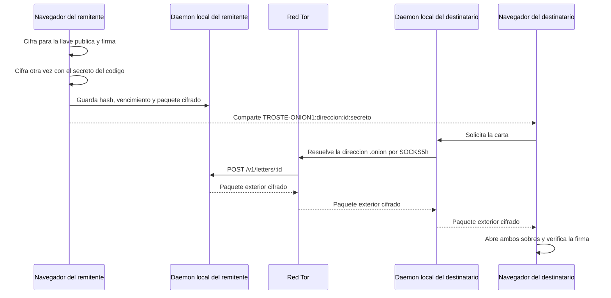

# Troste Onion

Troste Onion es una terminal local de cartas cifradas. Cada equipo publica su propio buzon como un Onion Service v3 y entrega las cartas directamente por Tor. No usa Supabase, una tabla central ni una IP publica fija.

> Estado: prototipo funcional para pruebas. La criptografia y la ruta Tor son reales, pero el proyecto aun no ha recibido una auditoria de seguridad independiente.

## Como funciona



La direccion `.onion` esta ligada a las llaves guardadas en `data/onion-service`. Cambiar de red o de IP no cambia la direccion. El navegador puede cerrarse despues de enviar una carta; el proceso de Troste Onion y Tor deben seguir encendidos para entregarla.

## Puesta en marcha

Requisitos:

- Node.js 22 o posterior.
- Acceso a Internet para instalar la dependencia y el Tor Expert Bundle.

```powershell
npm install
npm run tor:install
npm start
```

Abre `http://127.0.0.1:8741`. La interfaz mostrara cuando Tor termine de construir el circuito y publique el buzon.

No expongas los puertos `8741`, `8742` o `9060` en el router. Los tres escuchan solo en loopback. El puerto virtual del Onion Service llega a `127.0.0.1:8742` mediante Tor.

## Que se guarda

Por cada carta, el daemon local conserva:

- `nodeId`: identificador aleatorio.
- `secretHash`: SHA-256 del secreto de ruta ligado al `nodeId`.
- `expiresAt`: vencimiento, como maximo 90 dias.
- `payload`: el sobre exterior cifrado con AES-256-GCM.

El daemon no guarda el secreto del codigo ni el texto legible. Dentro del sobre exterior existe otro sobre cifrado para la llave ECDH del destinatario y firmado con ECDSA por el remitente. Las llaves privadas de identidad permanecen en el navegador, protegidas por la frase local elegida por el usuario.

## Codigo de entrega

```text
TROSTE-ONION1:<direccion-onion-v3>:<node-id>:<secreto-base64url>
```

- La direccion indica que buzon debe responder.
- El ID selecciona el archivo local sin revelar el texto.
- El secreto autoriza la descarga y abre el sobre exterior.
- Solo la llave privada del destinatario abre el sobre interior.

Robar el codigo completo permite descargar el paquete mientras exista, pero no leer la carta sin la identidad privada destinataria. Robar solo el disco del daemon no entrega el secreto ni el texto. Una persona que controle el navegador o el sistema operativo de alguno de los extremos si puede capturar la carta o las llaves.

## Configuracion

Copia `.env.example` a `.env` solo cuando necesites cambiar los valores predeterminados. Node carga ese archivo al iniciar.

| Variable | Predeterminado | Uso |
| --- | --- | --- |
| `TROSTE_UI_PORT` | `8741` | Interfaz y API local |
| `TROSTE_ONION_PORT` | `8742` | Protocolo que recibe Tor |
| `TOR_SOCKS_PORT` | `9060` | Salidas hacia otros buzones Onion |
| `TROSTE_DATA_DIR` | `./data` | Nodos y llaves persistentes del servicio |
| `TOR_BINARY` | autodeteccion | Ruta a un binario de Tor existente |
| `TROSTE_MANAGE_TOR` | `true` | Inicia y detiene Tor con Troste |
| `TROSTE_ONION_ADDRESS` | vacio | Direccion v3 al usar Tor externo |

No publiques `.env`, `data/`, `vendor/tor/` ni `node_modules/`. En particular, `data/onion-service` contiene la llave privada que mantiene estable la direccion del buzon.

## Pruebas

```powershell
npm test
```

La suite cubre doble cifrado, destinatario incorrecto, alteracion de sobres, firma, validacion de direcciones Onion v3, permisos HTTP, vencimiento, revocacion y formato del almacenamiento.

## Limites honestos

- El remitente debe mantener el daemon encendido hasta que la carta sea recogida.
- Perder las llaves privadas del navegador hace irrecuperables sus cartas.
- Tor reduce la exposicion de IP y cifra la ruta, pero no vuelve invulnerable un equipo comprometido ni elimina por completo el analisis global de trafico.
- La primera version es de escritorio. Un celular necesita ejecutar su propio daemon o una futura aplicacion nativa; abrir esta interfaz desde un servidor ajeno rompería el modelo de confianza del codigo criptografico.
- No se debe desplegar en Vercel: este proyecto necesita un proceso persistente de Tor, almacenamiento local y puertos loopback.

Consulta [SECURITY.md](SECURITY.md) y [docs/PROTOCOL.md](docs/PROTOCOL.md) antes de exponer cartas reales.

## Referencias

- [Tor Project: Onion Services](https://support.torproject.org/tor-browser/features/onion-services/)
- [Tor Project: configurar un Onion Service](https://community.torproject.org/onion-services/setup/)
- [Tor Project: Tor Expert Bundle](https://www.torproject.org/download/tor/)
- [Especificacion de Onion Services v3](https://spec.torproject.org/rend-spec-v3/)

